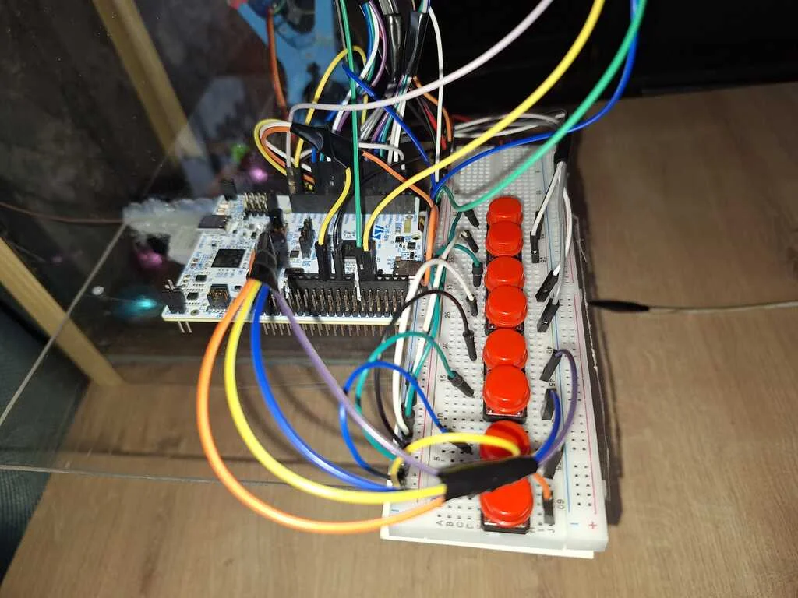
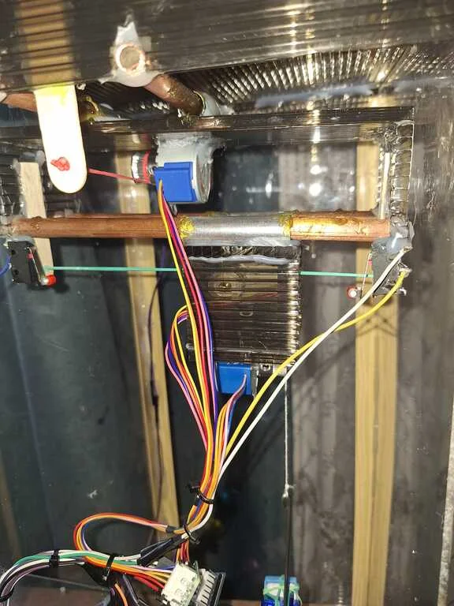
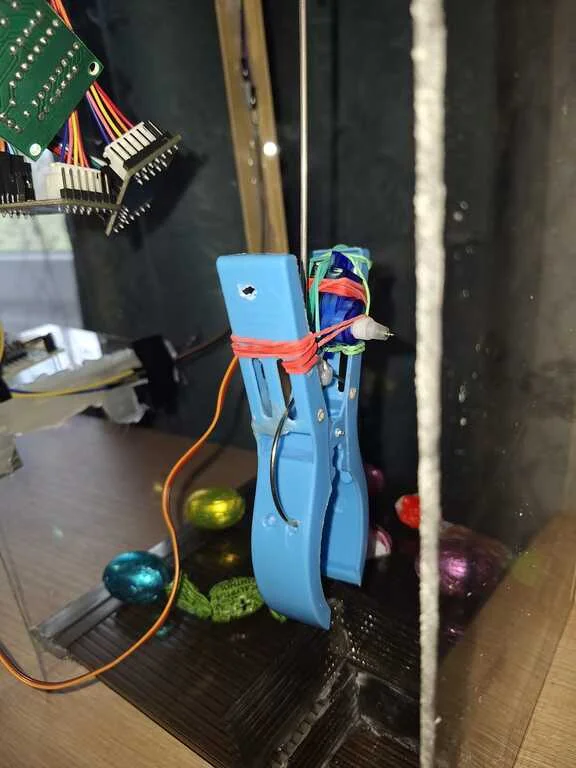
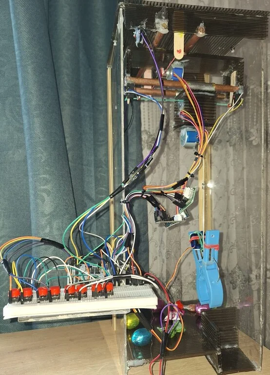

# Claw Machine

An arcade claw machine that lets players grab prizes using a custom claw.

:::info

**Author**: Anca-Maria Stanciu \
**Github Project Link**: https://github.com/Anca04/pm-proiect

:::

## Description

The project is an interactive **Claw Machine** designed to grab and move objects. The claw is controlled by the user and can move in three directions: left-right (OX axis), front-back (OY axis) and up-down (OZ axis).

Using a set of buttons, the player moves the claw over a prize, lowers it to grab the object, and then moves it to a special drop area. The player also has full control over the claw's grip, opening and closing it at the right moment to secure a win. To make the machine reliable and safe, it is designed to recognize its own limits, so it knows exactly when to stop at the edges of the frame. It's a project focused on building a fun, manual experience where the player's skill and timing are the main attractions.

## Motivation

The idea for this project started during a brainstorming session with a colleague. It brought back a personal memory from the end of high school when, after finishing my university entrance exam, I played at a claw machine to celebrate. I chose to build this project to recreate that experience.

## Architecture

The project is divided into a few main parts that work together to make the claw machine move and grab prizes.

Main Components:
* **The Controller**: The 'brain' of the machine (the STM32 board). It processes the logic of the arcade game and coordinates all other parts.
* **The Movement System:** Three motors responsible for movement. They ensure the claw reaches the exact position above the prize and handle the up-and-down movement.
* **The Grip System**: The claw is powered by a SG90 servo motor that opens and closes it. This part is responsible for picking up the prize.
* **The Buttons**: A set of buttons mounted on a breadboard. These allow the player to move the claw on the OX, OY, and OZ axes and operate the grip.
* **Boundaries**: Small switches placed at the ends of the axes (OX and OY). They tell the STM32 to stop the motors if the claw reaches the edge of the frame.

## Log

### Week 16 - 20 March

Defined the concept of the project and the list of the components.\
Analyzed the movement logic for the OX, OY, and OZ axes.\
Researched the necessary limit switches for boundaries.

### Week 23 - 27 March

Researched and selected the stepper motors to ensure the movement of the claw.\
Selected the appropriate servo motor for the claw's opening and closing mechanism.\
Chose a button-based interface instead of a joystick to avoid misalignment and ensure precise directional control.

### Week 30 March - 3 April
Ordered the hardware components.

### Week 6 - 11 April
Built the casing and assembled the 3-axis system.\
Assembled the claw and the gripping mechanism using the servo motor.\
Connected the motors and limit switches to the STM32.\
Developed the control code, testing each component individually.\
Finalized the assembly and debugging of the entire project, resulting in a fully functional 3D claw machine.

<iframe width="100%" height="450" 
src="https://www.youtube.com/embed/UxUb1glXL0c" 
title="Claw Machine Demo" 
frameborder="0" 
allow="accelerometer; autoplay; clipboard-write; encrypted-media; gyroscope; picture-in-picture; web-share" 
allowfullscreen></iframe>

## Hardware

### Bill of Materials
 Device                                                                                 | Usage                            | Price                                                                                                                                                             |
| -------------------------------------------------------------------------------------- | -------------------------------- | ----------------------------------------------------------------------------------------------------------------------------------------------------------------- |
| [STM32](https://www.st.com/resource/en/datasheet/stm32f722ic.pdf) | The microcontroller | [110 RON]() |
| Stepper Motor and Drivers | Used for precise movement of the claw on the OX, OY, and OZ axes | [16.97 RON](https://www.optimusdigital.ro/ro/motoare-motoare-pas-cu-pas/101-driver-uln2003-motor-pas-cu-pas-de-5-v-.html?search_query=stepper&results=48) x 3 |
| SG90 Servo Motor | Operates the claw's gripping mechanism (opening and closing) | [13.99 RON](https://www.optimusdigital.ro/ro/motoare-servomotoare/26-micro-servomotor-sg90.html?search_query=servo+motor&results=123) |
| Micro Limit Switch | Acts as an endstop for axis safety | [5.23 RON](https://sigmanortec.ro/Endstop-mecanic-SS-5GL2-p136284192) x 4 |
| GT2 Timing Pulley - 20 Teeth, 5mm Bore | Connected to the motors to move the cords for each axis. | [4.67 RON](https://sigmanortec.ro/Fulie-dintata-GT2-20-dinti-ax-5mm-p125814315) x 3 |
| Breadboard | Used for organizing and connecting all electronic parts and power lines. | [11.30 RON](https://sigmanortec.ro/Breadboard-830-puncte-MB-102-p125923983) | 
| Plexiglass | Used to build the walls. | 70 RON |
| Polycarbonate Sheets | Used to build the floor and the structural system for the axis movement. | 20 RON |
|                                                                                        | Total                            | 311.13 RON                                                                                                                                                        |

## Links

1. https://embedded-rust-101.wyliodrin.com/docs/acs_cc/category/lab
2. https://ai.thestempedia.com/project/diy-candy-claw-machine/
3. https://www.hackster.io/TechGuru/amazing-diy-robotic-gripper-0ead3c
4. https://www.youtube.com/watch?v=xJyjdwXrtXc